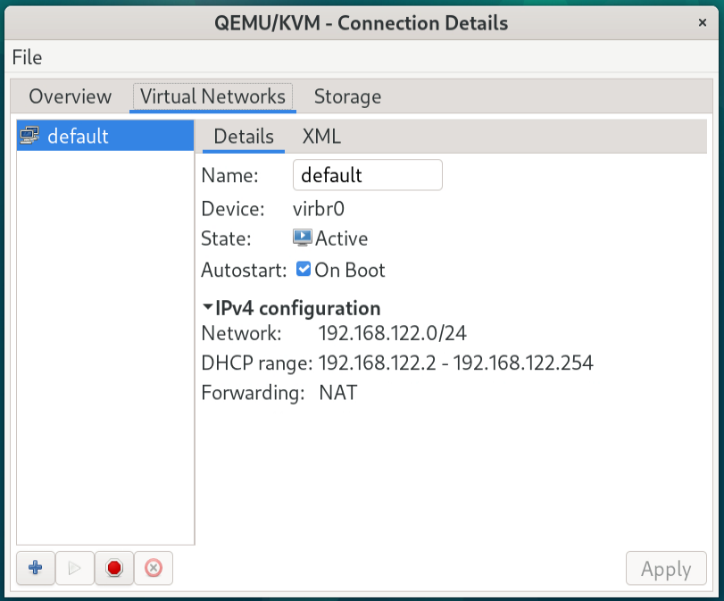

# KVM Installation to Debian 12

Author: Dave Prowse  

[Prowse Tech](https://prowse.tech)

For this lab I am working on my main system (Core i7, Asus Motherboard) with Debian 12 installed.

Click [**here**](https://www.youtube.com/watch?v=GgAQw08zJzs) for the companion video on YouTube.

---
> **NOTE**  
For an in-depth explanation of KVM in Linux, see [this link](https://prowse.tech/kvm/).

---

## Prepare the system

- Verify if your BIOS/UEFI has virtualization enabled as well as IOMMU (if listed separately).

> Note: For efficient I/O virtualization/full network connectivity, you might also want to check if SR-IOV is enabled in the BIOS.*

- Boot into Debian and access a terminal. Type the following command to see if Linux sees that virtualization is enabled.

    `lscpu | grep Virtualization`

    You should see results similar to the following:

    ```console
    dpro@smauggy:~$ lscpu | grep Virtualization
    Virtualization:                     VT-x
    ``````


- Update your system (as root)

    `apt update && apt upgrade -y`  

    Reboot if necessary.

## Install and Verify KVM

- Install packages:

    ```console
    sudo apt install qemu-kvm qemu-utils libvirt-daemon-system libvirt-clients virtinst virt-manager
    ```

    > NOTE: `qemu-kvm` will select the proper QEMU installation for your system's hardware (for example, `qemu-system-x86`). You could instead use `qemu-system` which will also work, but will install a **lot** more packages. See [this link](https://www.linux-kvm.org/page/Downloads) for more information.  
    Some of the packages listed above may already be installed or might not be necessary.

- Check the service:
  
  `systemctl status libvirtd`  

  If it is not running, enable it and start it:

  `systemctl --now enable libvirtd`

  Check the service again with the previous command and make sure that it is active and running.

  > Depending on your configuration you may have to reboot your system. If in doubt, reboot for good measure!

- Check QEMU and Virsh versions:

    `kvm --version`

    > Or use: `/usr/bin/qemu-system-x86_64 -version`
  
    `virsh --version`

    Sample results:

    ```console
    dpro@smauggy:~$ kvm --version ; virsh --version
    QEMU emulator version 7.2.7 (Debian 1:7.2+dfsg-7+deb12u3)
    Copyright (c) 2003-2022 Fabrice Bellard and the QEMU Project developers
    9.0.0
    ```

    Excellent work! Your KVM installation should now work properly. But... let's analyze further!

## Analyze KVM

- Check that the KVM modules are loaded correctly.  

    `lsmod | grep kvm`

    Sample results:

    ```console
    dpro@smauggy:~$ lsmod | grep kvm
    kvm_intel             380928  0
    kvm                  1142784  1 kvm_intel
    irqbypass              16384  1 kvm
    ```

- Run the following command to view the various components that should run in KVM:

    `sudo virt-host-validate`

    You should see results similar to the following:

    ```console
    dpro@smauggy:~$ virt-host-validate
    QEMU: Checking for hardware virtualization                                 : PASS
    QEMU: Checking if device /dev/kvm exists                                   : PASS
    QEMU: Checking if device /dev/kvm is accessible                            : PASS
    QEMU: Checking if device /dev/vhost-net exists                             : PASS
    QEMU: Checking if device /dev/net/tun exists                               : PASS
    QEMU: Checking for cgroup 'cpu' controller support                         : PASS
    QEMU: Checking for cgroup 'cpuacct' controller support                     : PASS
    QEMU: Checking for cgroup 'cpuset' controller support                      : PASS
    QEMU: Checking for cgroup 'memory' controller support                  the above should be possible    : PASS
    QEMU: Checking for cgroup 'devices' controller support                     : WARN (Enable 'devices' in kernel Kconfig file or mount/enable cgroup controller in your system)
    QEMU: Checking for cgroup 'blkio' controller support                       : PASS
    QEMU: Checking for device assignment IOMMU support                         : WARN (No ACPI DMAR table found, IOMMU either disabled in BIOS or not supported by this hardware platform)
    QEMU: Checking for secure guest support                                    : WARN (Unknown if this platform has Secure Guest support)   
    ```

    > Be sure to run the command with `sudo` so that you can obtain more accurate results.

    > You will also see LXC options. Those are for containerization in Linux which is also supported by libvirt. However, we are only concerned with the "QEMU" items in the list.

## Configure the system so that KVM will be as functional as possible

### IOMMU

One of the most important elements is IOMMU support. In the results above you can see it says "WARN" which tells us that it is probably not configured properly.

IOMMU = input-output memory management unit. 

- Connects DMA-capable I/O to main memory.
- Allows for PCI passthrough, memory protection, and so on.  
- Must be enabled in the BIOS (if it exists)

Once you verify that it is enabled in the BIOS, configure the following in Debian Linux:  

- Go to `/etc/default/grub`
- Modify the following line:
`GRUB_CMDLINE_LINUX="intel_iommu=on"`  
- Then, `update-grub` or and/or reboot system.

> Note: For Debian 12, this is not necessary as IOMMU works fine out of the box - that is, if it is available on the hardware platform in question, and is enabled in the BIOS/UEFI.

### Support for other items (devices, freezer, etc)

In `/etc/default/grub` make the following additions:

```console
GRUB_CMDLINE_LINUX="cgroup_enable=devices  group_enable=freezer intel_iommu=on"
```

And `update-grub` or reboot.

> **Important! Go for CLEAN virt-host-validate results!**

> Note: You might not be able to fully enable all features depending on your hardware configuration. However, if you have a proper server, you should be able to get a relatively clean set of results. Also, there are alternate ways to configure items (devices, freezer, and so on) such as using the Kconfig file or referencing multiple cgroups). Each system is different! In addition, "freezer" probably won't display proper results because in cgroups v2 a "freezer" doesn't need a separate controller. 

## Set up a USER ACCOUNT

Add a user to the libvirt group so that it can create and modify virtual machines.

`sudo usermod -aG libvirt <username>`

If this is the same user account that you are currently working on, then logout and log back in for the change to take effect. 

at this point the user account should be able to work with CLI and GUI-based KVM tools.

## View and/or Start the Default KVM Network

Type the following command: 

`sudo virsh net-list`

You probably won't see any running networks. By default in Debian, they are not started. So, let's start the *default* network.

`sudo virsh net-start default`

And, set it to autostart whenever the system is rebooted.

`sudo virsh net-autostart default`

Now apply the changes. These can be applied by restarting the libvirtd service or by restarting the computer.

`systemctl restart libvirtd`

> Note: You could also set this to autostart by using the GUI-based tool virt-manager.

Now, let's view our KVM networks again:

`sudo virsh net-list`

You should see results similar to the following:

```console
dpro@smauggy:~$ sudo virsh net-list
 Name      State    Autostart   Persistent
--------------------------------------------
 default   active   yes         yes
```
> Note that sudo is required here. If you don't use it, then it won't display any KVM networks. Also, you need to be working as a member of the libvirtd group.

You can have multiple KVM networks. To learn more about a particular KVM network, use the following command:

`sudo virsh net-info <network_name>`

Results will be similar to the following:

```console
dpro@smauggy:~$ sudo virsh net-info default
Name:           default
UUID:           4c0cda39-168a-4849-8504-b633253a002f
Active:         yes
Persistent:     yes
Autostart:      yes
Bridge:         virbr0
```

## virt-manager

The `virt-manager` program is the gui-based equivalent (and aggregate) of `virsh` and other tools such as `virt-install`, `virt-clone`, and `virt-xml`.

Run the program now in the terminal:

`virt-manager`

That should open a GUI-based window. The initial view is where virtual machines are displayed. For now, all you should see is "QEMU/KVM".

Navigate to Edit > Connection Details > Virtual Networks.

You should see something similar to the figure below:



In the figure you can see that the default network is Active and is set to Autostart On Boot. We did that previously with the `virsh` commands, but could accomplish the same thing here. After any modifications, be sure to click the Apply button so that they will take effect.

You will also note the default IPv4 configuration. It uses the 192.168.122.0/24 network and automatically sets up a gateway/DNS/DHCP server at 192.168.122.1. The DHCP server has an IP range of .2 through .254. This is the default NAT-based configuration where you can create isolated virtual machines to your heart's delight&mdash;or at least 253 of them! They can communicate with the Internet by default, and your hosting system can communicate with them as well. Fantastic!

## Closing

That's it. We now have a working installation of KVM on Debian 12. It simply rules! 👍 😄 💻

Go forth and use it.
